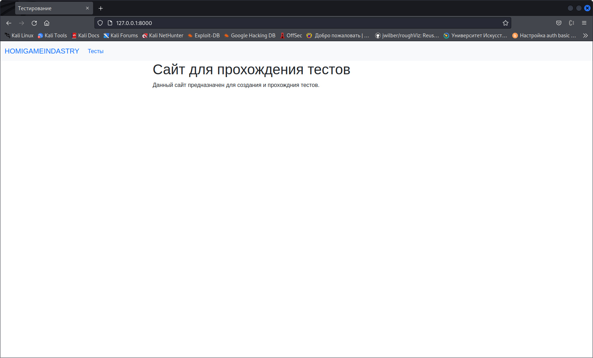
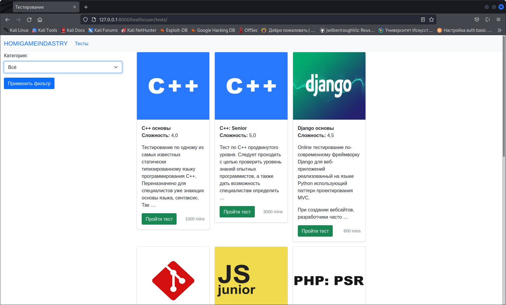
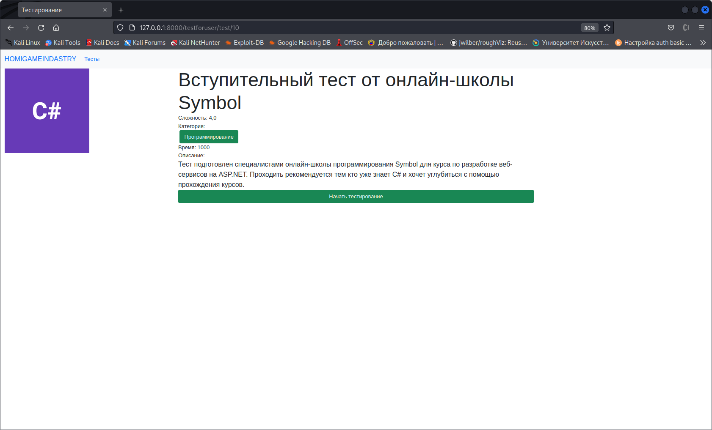
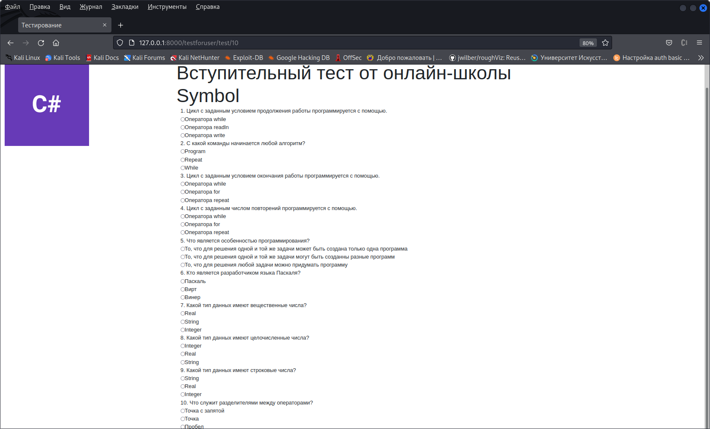
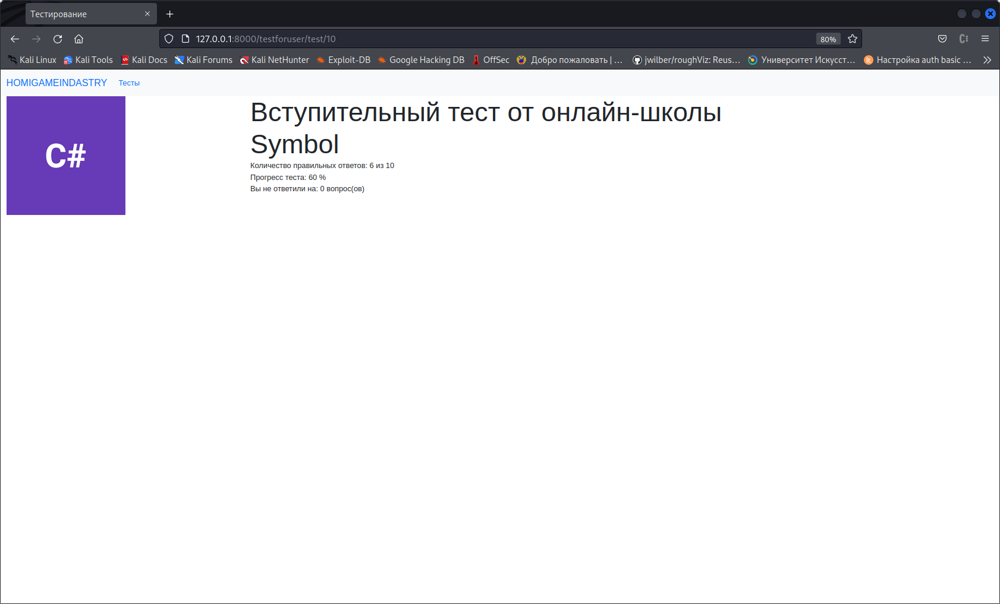

# Progger_Site 
# Описание
Данный сайт предназначен для создания тестов и прохождения тестов. На данный момент тесты имеют категории и фильтруются по ним. 
Один тест может иметь несколько категорий. Загрузка, проверка и демонстрция результата тестирования осуществляется через JQuery.
# Установка
Для установки трбуется python3.10 или выше, а также выполнить команду pip3 install requirements.txt
# Демонстрация
Главная страница

Страница с тестами

Страница теста

Прохождение тетста

Результаты теста

